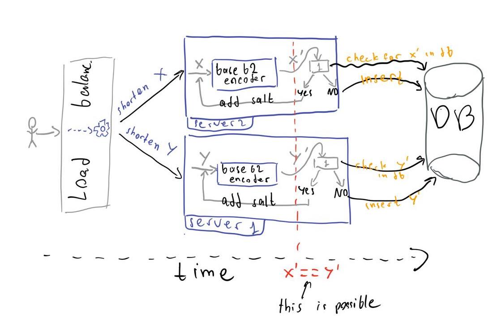
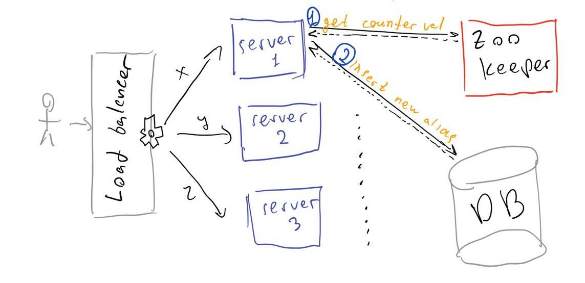

# System Design for URL Shortener like bitly.com
Here we will try to design highly available and scalable URL shortener system. This system won't concentrate about
implementation details and will only contain high level abstraction of the system ( to leave all choices of specific technologies to the implementator ).

## Introduction
There are lots of cases when you want to paste some long URL you found on web in some document, but due to it being too long its not practical.
URL shorteners are web applications which solve this exact issue. Using URL shorteners we can input long URL and system will map it to some unique short value which and store this mapping in the database.
So whenever user asks for original URL for some shortened key system will have information about it. 

## Funtional requirements
- Given some URL service should generate unique shortened alias for this URL
- When request comes to this shortened alias server should redirect user to original URL
- Links must have expiration time ( Let's call it EXP-TIME )
- Shortened links/aliases should not colide ( must be unique )  

## Non-functional requirements
- System must be highly available, so that one components failure won't make our service unusable.
- System must be scalable. We should be freely able to scale services later if traffic increases.

Before we make any further asumptions and dive into analyzing new system we must revise what are components we need to do to reach final system:
- Think about Data Model, what fields and units of data will our system persist
- Which type of Database Storage will best fit our problem? In terms of data storage, scalability, high availability. 
- Application level details of implementation for business logic. What are external/other technologies and services our app might use to execute business logic ( like zookeeper, message queues and etc ). 
- How to scale application servers ( stateless server, Vertical scaling, horizontal scaling, caching, Load balancers, etc ). 
- Increasing performance ( caching, etc. ) 

## Data Model and Storage
##### Of what structure and how much of data will our system store
- Let's assume we have 30M new users every month. And let's assume that EXP-TIME for aliases is 5 year.
To translate this information in data size we get: 30M * 12(months) * 5(years) = 1.8 Billion records.
- Data capacity model: This will help us understand how much data we'll store in the storage. 
We need to think about what data(with it's size) we'll store in persistant storage for one distinct shortened url(we'll need to calculate according storage volume for 5 years, since we are leaving data in the storage for that long).
	DATA RECORD MODEL:
	- longurl: string of 2KB size ( 2048 characters ).
	- shorturl: string of 17 bytes ( 17 characters) .
	- createdAt: 7 byte time-stamp
	- expiresAt: 7 byte time-stamp
Total size of 1 record in storage will be: 2KB + 17B + 7B + 7B = 2031B = 2.031KB.
For 30M monthly users this will be 30M * 2.031KB ~ 60GB per month. and 3.64TB of data in 5 years.

##### Choosing right storage type ( SQL or NoSQL )
Since we have this much data we'll need to think carefully of Which database to choose, since we'll need to replicate this data and make it highly available.
Since our system is read heavy ( user stores once and might need redirection thousands of times after that ) and we will need to think about scaling and high
availability because of non-functional requiremenets. For this case we will avoid using RDBMS(PostgreSQL, MySQL) since they add complexity for scaling and
high availability since it's not their inherent feature). On the other side NoSQL databases will be match our non functional requiremenets easily since that's
what they are made for ( HA and Scalability ). The only problem we might come across with NoSQL is eventual consistency and lack of ACID transactions so we might
need to design the logic of the system so that we will avoid need for ACID.

NOTICE: we could make use of RDBMS but it will just be much more complex store than any NoSQL one.

## Application level business logic overview
Here we'll need to think of a good mechanism that will shorten input URL-s, which will scale with multiple server instances and and also avoid collisions between mappings.
#### Case 1 ( Not correct, violates collisions during several server instnaces )
In this case on every server we'll have code that will execute next logic:
- Use Base62 encoding to map some URL to shortened alias.
- Check if alias is already present in database, if answer is yes: add some random salt to it and insert mapping; if answer is no: insert mapping.
This mechanism will work only if we have 1 instance of the server running, but since we'll need to scale, we'll have several servers executing this logic.
This means that several servers might easily create a race condition ( if 2 or more of them get different input URLS and all generate same Base62 alias,
before they insert they check and all validate that no current Base62 value is present and all put, latest one will overwrite prev. values.
(This case is very well possible since base62 encoding doesn't guarantee uniqueness of output in any way ) and we could easily use another alias generation
mechanism as well ( md5, base64 or etc ) but all of them will suffer due to race condition problem.

NOTICE: So this solution of business logic is no good because of race condition

### Case 2 ( Correct solution )
The main problem with the previous solution was that several instances of the application servers weren't synchronized between each other for url generation,
so bad things could have happened. For use we'll need to out-source the synchronization and alias generation logic from main server app, for all of them
to be able to be on the same page and synchronize/coordinate. 
General mechanism we will use is very simple, we will use counters. Yep, simple counters. Let's think of several cases.
It is no good if all servers will have their own local counters. Since next are cases that server-local mechanism won't solve:
- if one server fails that we don't have global knoweledge of where it stopped so that we can spin up another server to continue where first stopped.
- if one server reaches counter limit, this server will become non functional since we don't have any external mechanism to give it a new range of counter to continue working.

Solution to this problem as we told will be to have an external mechanism/application that will itself be highly avaiable and distributed and that will coordinate
all our server nodes to provide them appropriate counter values.
Zookeeper is this kind of software, it's definition sounds like this: Zookeeper is basically a distributed coordination service that manages a large set of hosts.
It keeps track of all the things such as the naming of the servers, active servers, dead servers, configuration information of all the hosts.
It provides coordination and maintains the synchronization between the multiple servers. 

So using zookeeper our mechanism becomes next:
Zookeeper will store the state of what are currently active counters ( currently active counters that servers use ) and what are ranges for each server. 
Every server will have their non-overlapping range ( which will guarantee that they'll generate unique aliases and won't need to check before insertion).
This way:
- If one server fails, information about what range was used by it and where did it stop won't be lost. it will still be available in zookeeper store for new nodes to use,  
- If one server reaches the limit of it's counter it can easily ask zookeeper to assign to it a new range of values to use.

## Counting redirect requests
One last mechanism that we need to go through is how to count number of redirection requests for each url.
It is trivial that we'll need a new field for data model, the field called: "counter". But now the question arises: since redirection of the user must be
reactive/fast/low latency we can't increase the complexity and time usage for the main flow of the application which fetches original link from database, it should be minimallistic.
For this problem we can introduce kafka or other reliable streaming solution. our main application flow will asyncrhonously ( wihtout hanging ) will send new redirect message to kafka ( as an event producer ).
On the other side we can write kafka consumer application which will fetch for new redirectm messages and increase counter values for each redirection events.

